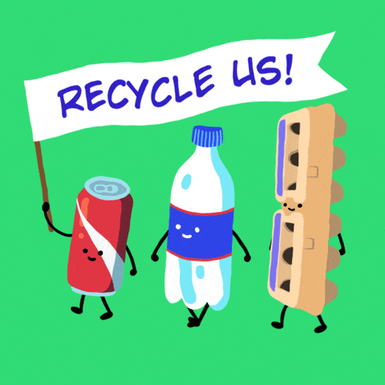

# Trash Detection and Sorting

---

> This application detects and sorts trash by categories. We used deep learning, Mask RTCNN, YOLOv5, for our solution. Nevertheless, we also used streamlit to create the Web Graphical User Interface(GUI) of the project.

## About our team, Paza Anulare

Hello, we are Eduard Balamatiuc, Alex Clefos, Elena Graur and Mihai Moglan, Machine Learning and Computer Vision Engineers at Titanium and Sigmoid.

Check us on Social Media

Mihai Moglan: [Facebook](https://www.facebook.com/mihai.moglan.1) [LinkedIn](https://www.linkedin.com/in/mihai-moglan-237b14151/) [GitHub](https://github.com/yourbeach)

Eduard Balamatiuc: [Facebook](https://www.facebook.com/eduard.balamatiuc) [LinkedIn](https://www.linkedin.com/in/eduard-balamatiuc/) [GitHub](https://github.com/pyramixofficial)

Alex Clefos: [Facebook](https://www.facebook.com/profile.php?id=100005089337863) [LinkedIn](https://www.linkedin.com/in/alexandru-clefos-ab9604204/) [GitHub](https://github.com/greek-2312)

Graur Elena: [Facebook](https://www.facebook.com/elena.graur.94) [LinkedIn]() [GitHub](https://github.com/MrCrowley21)

